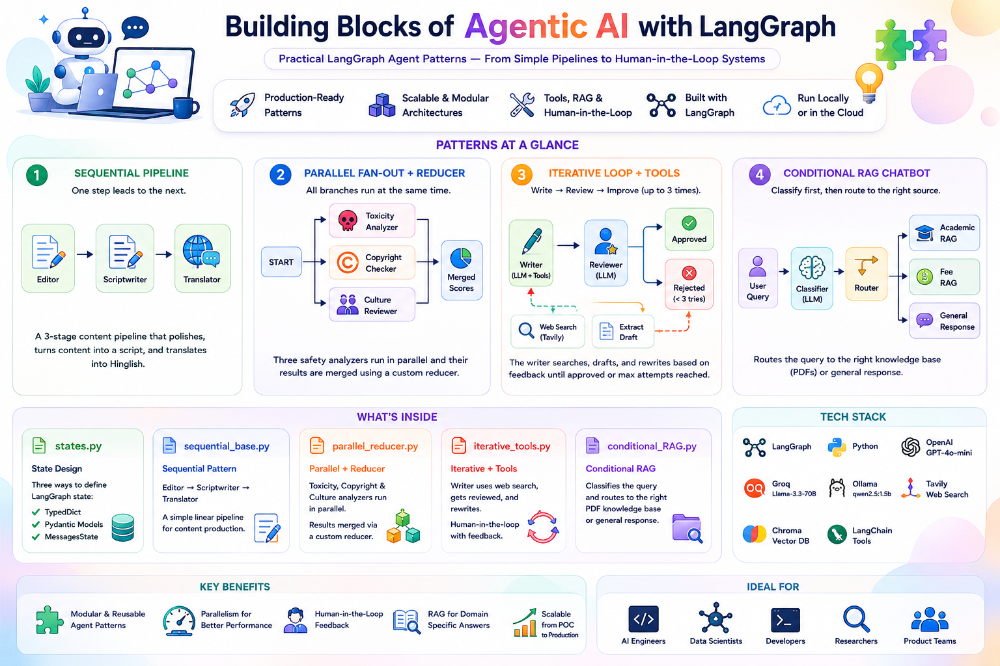

# 🤖 Building Blocks of Agentic AI with LangGraph



A focused, practical collection of **LangGraph agent patterns** — from the simplest sequential pipeline to a full iterative human-in-the-loop content generation system. Each script is a standalone, runnable Python program that demonstrates one core architectural idea in agentic AI.

---

## 🗺️ What's Inside

| File | Pattern | What It Builds |
|---|---|---|
| [`states.py`](#1-statepy--langgraph-state-patterns) | State Design | Three ways to define LangGraph state: `TypedDict`, Pydantic, and `MessagesState` |
| [`sequential_base.py`](#2-sequential_basepy--linear-pipeline) | Sequential | A 3-stage content pipeline: Editor → Scriptwriter → Translator |
| [`parallel_reducer.py`](#3-parallel_reducerpy--parallel-fan-out--reducer) | Parallel + Reducer | Three content-safety analyzers running in parallel, results merged via a custom reducer |
| [`iterative_tools.py`](#4-iterative_toolspy--iterative-writer--reviewer-loop) | Iterative + Tools | A LinkedIn post writer that searches the web, drafts, gets reviewed, and rewrites up to 3 times |
| [`conditional_RAG.py`](#5-conditional_ragpy--conditional-rag-chatbot) | Conditional RAG | A college assistant chatbot that classifies queries and routes to the right PDF knowledge base |

---

## 🏗️ Patterns at a Glance

### Sequential — one node feeds the next
```
START → editor → scriptwriter → translator → END
```

### Parallel Fan-out — all branches fire from the same entry, results merged
```
START ─→ toxicity_node  ─┐
       ─→ copyright_node ─┼→ END  (custom reducer merges score dicts)
       ─→ culture_node  ─┘
```

### Iterative Loop — a feedback cycle with a conditional exit
```
START → writer → [tools →] extract_draft → reviewer
                     ↑                          │
                     └── rejected (< 3 tries) ──┘
                                                │
                                           approved / max tries → END
```

### Conditional RAG — classify first, then route to the right retriever
```
START → classifier → router
                     ├→ academic_rag → response → END
                     ├→ fee_rag      → response → END
                     └→ general      → response → END
```

---

## 📦 Installation

```bash
pip install -r requirements.txt
```

### 🧠 Install Ollama (local LLM)

Download from [ollama.com](https://ollama.com), then pull the models used across scripts:

```bash
ollama pull qwen2.5:1.5b
ollama pull nomic-embed-text
```

### 🔑 Environment Variables

Create a `.env` file in the repo root:

```env
GROQ_API_KEY=your_groq_api_key
OPENAI_API_KEY=your_openai_api_key
TAVILY_API_KEY=your_tavily_api_key
LANGCHAIN_TRACING_V2=true
LANGCHAIN_API_KEY=your_langsmith_api_key
```

| Key | Required By |
|---|---|
| `GROQ_API_KEY` | `sequential_base.py`, `iterative_tools.py` (reviewer) |
| `OPENAI_API_KEY` | `iterative_tools.py` (writer) |
| `TAVILY_API_KEY` | `iterative_tools.py` (web search tool) |
| `LANGCHAIN_API_KEY` | All (optional LangSmith tracing) |

> `conditional_RAG.py` and `parallel_reducer.py` run **entirely locally** via Ollama — no API keys needed.

---

## 🧪 How Each Script Works

### 1. `states.py` — LangGraph State Patterns

A reference sheet for the three most common ways to define graph state in LangGraph:

```python
# TypedDict — lightweight, no validation
class State(TypedDict):
    topic: str
    summary: str
    score: str

# Pydantic — full validation with field constraints
class State(BaseModel):
    topic: str
    score: int
    summary: str = ""

    @field_validator
    def score_positive(cls, v):
        if v < 0:
            raise ValueError("Score must be positive")

# MessagesState — built-in message history with add_messages reducer
class State(MessagesState):
    user_name: str
    language: str
```

Use this as a cheat sheet when starting a new LangGraph project.

---

### 2. `sequential_base.py` — Linear Pipeline

A 3-node **content production pipeline** powered by `llama-3.3-70b-versatile` on Groq. Each node transforms the state and passes it to the next:

- **Editor** — cleans grammar, fixes typos, smooths transitions
- **Scriptwriter** — rewrites the polished text as a punchy YouTube video script
- **Translator** — translates the script into Hinglish (Hindi-English code-mix)

```python
graph.add_edge(START, "editor")
graph.add_edge("editor", "scriptwriter")
graph.add_edge("scriptwriter", "translator")
graph.add_edge("translator", END)
```

Run it:
```bash
python sequential_base.py
```

---

### 3. `parallel_reducer.py` — Parallel Fan-out + Reducer

Three content-safety checks run **simultaneously** on the same input text, each scoring 0–100 via `qwen2.5:1.5b` (fully local):

- **Toxicity node** — profanity, aggression, hate speech
- **Copyright node** — plagiarism and trademark risk
- **Culture node** — regional/political/cultural insensitivity

All three write to the **same `safety_score` dict field**. A custom reducer merges the sub-dicts cleanly instead of overwriting:

```python
def merge_score_dicts(existing: dict, new_update: dict) -> dict:
    if existing is None:
        return new_update
    return {**existing, **new_update}

class AnalyzerState(TypedDict):
    raw_text: str
    safety_score: Annotated[dict[str, int], merge_score_dicts]
```

Output for a deliberately problematic script:
```python
{'toxicity_level': 85, 'copyright_risk': 40, 'cultural_insensitivity': 30}
```

Run it:
```bash
python parallel_reducer.py
```

---

### 4. `iterative_tools.py` — Iterative Writer + Reviewer Loop

The most complex script. A **two-LLM** pipeline builds a publish-ready LinkedIn post through a write → review → rewrite loop, with live web search available to the writer:

**Writer** (`gpt-4o-mini` + Tavily search tool):
- If the topic needs current info, searches the web before writing
- On rejection, receives the reviewer's feedback and produces an improved draft
- Constrained to strong hooks, 150–200 words, no hashtags

**Reviewer** (`llama-3.3-70b-versatile` via Groq):
- Grades the draft against 7 explicit criteria
- Returns a structured `VERDICT: APPROVED/REJECTED` + `FEEDBACK:` response

**Loop logic** — up to 3 attempts, exits early on approval:
```python
def should_stop_looping(state: State):
    if state["is_approved"]:
        return END
    if state["attempt"] >= 3:
        return END
    return "writer"
```

```
START → writer ──tool_call?──→ tools → writer
                 └── no ──→ extract_draft → reviewer
                                               │
                                     approved / max tries → END
                                     rejected → writer (loop)
```

Run it:
```bash
python iterative_tools.py
# → Enter a topic when prompted
```

---

### 5. `conditional_RAG.py` — Conditional RAG Chatbot

A **college student assistant** that classifies each incoming query and routes it to the right knowledge source — all running locally with Ollama + FAISS:

**Three document sources:**
- `academics_handbook.pdf` — attendance, exams, grades, credits, promotion rules
- `fee_structure.pdf` — tuition, payments, refunds, scholarships
- General LLM knowledge — for greetings and off-topic queries

**Classifier node** routes with a single LLM call:
```python
# Returns one of: "academic", "fee", "general"
```

**Router** picks the matching branch:
```python
def router_function(state) -> Literal['academic_rag', 'fee_rag', 'general']:
    if state['query_type'] == "academic":
        return "academic_rag"
    elif state['query_type'] == "fee":
        return "fee_rag"
    else:
        return "general"
```

**Response node** adapts its prompt based on whether retrieval happened — if `retrieved_context == "NO_RETRIEVAL_NEEDED"`, it answers directly from LLM knowledge; otherwise it grounds the answer in the PDF context and highlights figures relevant to the student's programme (BCA, BBA, or B.Com H).

The chatbot runs in an interactive loop in the terminal until the user types `exit` or `quit`.

Run it:
```bash
python conditional_RAG.py
# → Select your programme (1/2/3) and start asking questions
```

---

## ⚡ Tech Stack

| Layer | Tool |
|---|---|
| Graph orchestration | LangGraph (`StateGraph`, `ToolNode`, `MessagesState`) |
| Local LLMs | Ollama — `qwen2.5:1.5b` (parallel, RAG) |
| Cloud LLMs | Groq — `llama-3.3-70b-versatile` (sequential, reviewer) |
| Cloud LLMs | OpenAI — `gpt-4o-mini` (writer with tools) |
| Web search | Tavily (`TavilySearch`) |
| Embeddings | Ollama — `nomic-embed-text` |
| Vector store | FAISS (in-memory, local) |
| PDF loading | `PyPDFLoader` |
| Validation | Pydantic v2 |
| Env management | `python-dotenv` |
| Tracing | LangSmith (optional) |

---

## 🧠 Key Learnings

- **State design matters before graph design** — choosing between `TypedDict`, Pydantic, and `MessagesState` shapes everything downstream. `states.py` makes this concrete with three side-by-side examples.
- **Parallel fan-out with a custom reducer** is the cleanest way to run independent LLM calls concurrently — no threading code, just edges from `START` to multiple nodes and a merge function on the shared state field.
- **Iterative loops need two safeguards**: a conditional exit on success *and* a hard max-attempt ceiling to prevent infinite loops — `iterative_tools.py` shows both.
- **Tool-calling and iteration compose naturally in LangGraph** — the writer node handles both its first-time generation and its post-tool-result generation in one function by checking what the last message type is, keeping the graph simple.
- **Conditional RAG doesn't need a complex router LLM** — a single classify-then-route pattern (`conditional_RAG.py`) cleanly separates "which knowledge base?" from "what answer?", making each node do exactly one job.

---

## 🚀 Future Improvements

- Add a `human-in-the-loop` interrupt to `iterative_tools.py` so a real editor can approve/reject instead of an LLM reviewer
- Extend `conditional_RAG.py` to support multi-turn conversations with full message history
- Add LangSmith evaluation traces for the reviewer's scoring criteria in `iterative_tools.py`
- Swap FAISS for a persisted vector store (Chroma, pgvector) in `conditional_RAG.py` so the index survives restarts

---

## 👨‍💻 Author

Built for learning: Agentic AI design patterns with LangGraph, LangChain, Groq, OpenAI, and Ollama.
